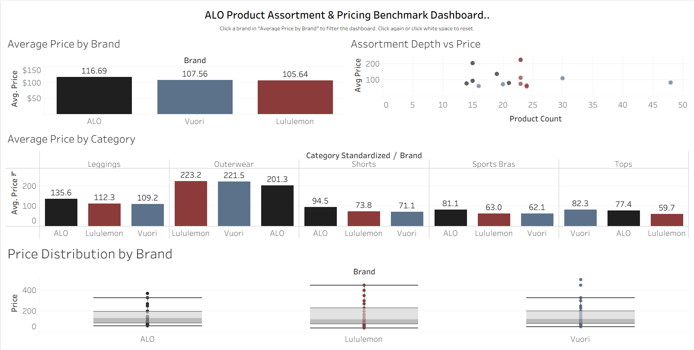

# ALO Product Assortment & Pricing Benchmark Dashboard

Tableau dashboard benchmarking ALO, Lululemon, and Vuori across pricing, category mix, and assortment depth.

## Project Overview
This project analyzes how ALO is positioned relative to key athleisure competitors by comparing product assortment and pricing across five categories:
- Leggings
- Sports Bras
- Tops
- Shorts
- Outerwear

The workflow included:
- scraping public product data with Python and Playwright
- cleaning and deduplicating the dataset
- loading the final dataset into SQLite for analysis
- building an interactive Tableau dashboard

## Tools Used
- Python
- Playwright
- SQLite
- Tableau

## Dashboard Questions
This dashboard answers:
- Which brand has the highest average price?
- How does average price differ by category?
- How are products distributed across price bands?
- Which categories are broader or narrower by brand?

## Key Findings
- ALO has the highest average price in the final sample, reinforcing its premium positioning.
- ALO is especially premium in leggings, shorts, and sports bras.
- Vuori has the broadest Tops assortment in the sample.
- Outerwear is premium across all three brands, though averages are influenced by high-priced outliers.
- Lululemon appears more balanced across categories, while ALO is more concentrated in core premium categories.

## How to Read the Dashboard
- **Average Price by Brand** compares overall pricing positioning across ALO, Lululemon, and Vuori.
- **Average Price by Category** shows where each brand is relatively more premium by product category.
- **Assortment Depth vs Price** maps each brand-category combination by product count and average price. Each point represents one category within one brand, helping distinguish broader assortments from narrower premium positioning.
- **Price Distribution by Brand** uses box plots to summarize median prices, spread, and outliers within each brand.

Vuori stands out for its larger Tops assortment, while Outerwear appears highest-priced across all three brands and is more sensitive to outliers.

## Files
- `tableau/ALO_Product_Assortment_Pricing.twbx` – Tableau workbook
- `tableau/products_detail_tableau.csv` – detail-level Tableau dataset
- `tableau/products_summary_tableau.csv` – summary Tableau dataset
- `data_clean/all_brands_products_deduped.csv` – final cleaned and deduplicated dataset

## Tableau Public
[View the interactive dashboard here](https://public.tableau.com/app/profile/tulio.machado.pinheiro/viz/ALOProductAssortmentPricingBenchmarkDashboard/ALOProductAssortmentPricingBenchmarkDashboard?publish=yes)

## Preview

## Engineering Notes
- Added scraper execution logging to track row counts by brand and category.
- Added export logging to record exported versus discarded rows.
- Added a validation script to check minimum category counts, missing URLs, and invalid prices before generating outputs.
- Separated reusable SQL logic into standalone `.sql` files for maintainability.
